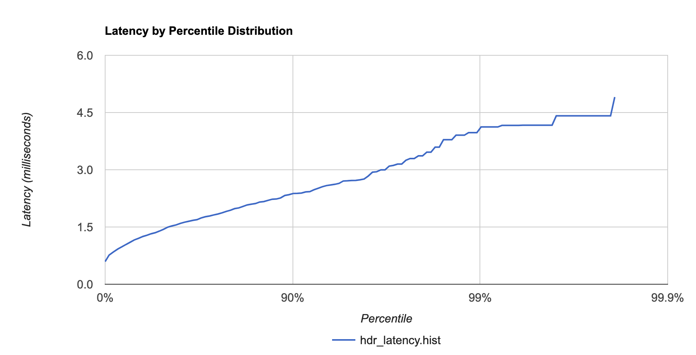

## Current use cases
This article documents the details on how to reproduce the graph database benchmark result on RedisGraph.
Currently, RedisGraph benchmark supports two use cases:


Name | Description and Source | Vertices | Edges
-- | -- | -- | --
graph500 | Synthetic Kronecker graph http://graph500.org | 2.4 M | 64 M
twitter | Twitter user-follower directed graph http://an.kaist.ac.kr/traces/WWW2010.html | 41.6 M | 1.47 B                                                                                                                                                                                                 

### How to use the benchmark

Graph benchmarking involves 3 phases: data retrieval, data loading/insertion, and query execution.

## Installation
The easiest way to get and install the benchmark code is to use:
```bash
git clone https://github.com/RedisGraph/graph-database-benchmark.git
cd graph-database-benchmark/benchmark/redisgraph
pip install --user -r requirements.txt
```

#### Data retrieval 

Variables:
1. `DATABASE_HOST` (default: `127.0.0.1`)
1. `DATABASE_PORT` (default: `6379`)
1. `BULK_DATA_DIR` (default: `/tmp/bulk_data`)
1. `DATASET_NAME` (default: `dependent on the use case`)
1. `EDGE_FILE` (default: `dependent on the use case`)
1. `NODE_FILE` (default: `dependent on the use case`)

The easiest way to get the datasets required for the benchmark is to use one of the helper scripts:
1. `./scripts/get_graph500_dataset.sh`
or
1. `./scripts/get_twitter_dataset.sh`

Sample output:
```bash
./scripts/get_graph500_dataset.sh
```

### Data insertion

##### Graph500


```bash
DATABASE_HOST=<...> BULK_DATA_DIR=/root/bulk_data ./scripts/redisgraph_load_graph500.sh
```


##### Twitter Benchmark

```bash
DATABASE_HOST=<...> BULK_DATA_DIR=/root/bulk_data ./scripts/redisgraph_load_twitter.sh
```


### Benchmarking query execution performance

#### Run K-hop neighborhood count benchmark
Change graph500-22-seed and twitter_rv.net-seed path to your seed file path.
Results will be stored in "result_redisgraph" output directory.

##### Graph500

Single Client Benchmark
```bash
# 10000 seeds, depth 1, 100 iterations per query ( Total of 1M queries )
WORKERS=1 DATABASE_HOST=<...> BULK_DATA_DIR=/tmp/bulk_data DEPTH=1 SEEDS=10000 ITERATIONS_PER_QUERY=100 ./scripts/redisgraph_run_graph500.sh
# 10000 seeds, depth 2, 100 iterations per query ( Total of 1M queries )
WORKERS=1 DATABASE_HOST=<...> BULK_DATA_DIR=/tmp/bulk_data DEPTH=2 SEEDS=10000 ITERATIONS_PER_QUERY=100 ./scripts/redisgraph_run_graph500.sh
# 10000 seeds, depth 3, 100 iterations per query ( Total of 1M queries )
WORKERS=1 DATABASE_HOST=<...> BULK_DATA_DIR=/tmp/bulk_data DEPTH=2 SEEDS=10000 ITERATIONS_PER_QUERY=100 ./scripts/redisgraph_run_graph500.sh
# 10000 seeds, depth 6, 100 iterations per query ( Total of 1M queries )
WORKERS=1 DATABASE_HOST=<...> BULK_DATA_DIR=/tmp/bulk_data DEPTH=2 SEEDS=10000 ITERATIONS_PER_QUERY=100 ./scripts/redisgraph_run_graph500.sh
```

Multi Client Benchmark
```bash
# 10000 seeds, depth 1, 100 iterations per query ( Total of 1M queries )
WORKERS=22 DATABASE_HOST=<...> BULK_DATA_DIR=/tmp/bulk_data DEPTH=1 SEEDS=10000 ITERATIONS_PER_QUERY=100 ./scripts/redisgraph_run_graph500.sh
# 10000 seeds, depth 2, 100 iterations per query ( Total of 1M queries )
WORKERS=22 DATABASE_HOST=<...> BULK_DATA_DIR=/tmp/bulk_data DEPTH=2 SEEDS=10000 ITERATIONS_PER_QUERY=100 ./scripts/redisgraph_run_graph500.sh
# 10000 seeds, depth 3, 100 iterations per query ( Total of 1M queries )
WORKERS=22 DATABASE_HOST=<...> BULK_DATA_DIR=/tmp/bulk_data DEPTH=2 SEEDS=10000 ITERATIONS_PER_QUERY=100 ./scripts/redisgraph_run_graph500.sh
# 10000 seeds, depth 6, 100 iterations per query ( Total of 1M queries )
WORKERS=22 DATABASE_HOST=<...> BULK_DATA_DIR=/tmp/bulk_data DEPTH=2 SEEDS=10000 ITERATIONS_PER_QUERY=100 ./scripts/redisgraph_run_graph500.sh
```

##### Twitter Benchmark

```bash
# 300 seeds, depth 1, 3 iterations per query
nohup python kn.py -g twitter_rv -s twitter_rv_net_seed -c 300 -d 1 -p redisgraph -l twitter_rv_net_unique_node -t 22 -i 3
# 300 seeds, depth 2, 3 iterations per query
nohup python kn.py -g twitter_rv -s twitter_rv_net_seed -c 300 -d 2 -p redisgraph -l twitter_rv_net_unique_node -t 22 -i 3
# 10 seeds, depth 3, 3 iterations per query
nohup python kn.py -g twitter_rv -s twitter_rv_net_seed -c 10 -d 3 -p redisgraph -l twitter_rv_net_unique_node -t 22 -i 3
# 10 seeds, depth 6, 3 iterations per query
nohup python kn.py -g twitter_rv -s twitter_rv_net_seed -c 10 -d 6 -p redisgraph -l twitter_rv_net_unique_node -t 22 -i 3
```

---------------------

## Building and running the benchmark client using docker
#### Building the benchmark client
```bash
# clone the repo
git clone https://github.com/RedisGraph/graph-database-benchmark.git       
                                                                
# make sure you're at this project folder
cd graph-database-benchmark/benchmark/redisgraph

docker build -t graph-database-benchmark-redisgraph .
```
#### Running the benchmark client
```bash
# run a 50 seeds, depth 1, 10 iterations per query benchmark
docker run --net=host tigergraph_redisgraph:latest -g graph500_22 -s graph500_22_seed -c 50 -d 1 -p redisgraph -l graph500_22_unique_node -t 50 -i 10 --stdout
```

You should be able to see a latency report similar to the presented bellow and use is to produce a latency percentile distribution chart, like the one presented here:
Sample Latency by percentile distribuition chart:


Full output:
```
Aggregate reports
Finalizing report
       Value     Percentile TotalCount 1/(1-Percentile)

      0.5940 0.000000000000          1           1.00
      0.7650 0.050000000000         26           1.05
      0.8490 0.097500000000         50           1.11
      0.9250 0.142625000000         72           1.17
      0.9820 0.185493750000         93           1.23
      1.0400 0.226219062500        114           1.29
      1.1010 0.264908109375        135           1.36
      1.1610 0.301662703906        151           1.43
      1.2050 0.336579568711        169           1.51
      1.2520 0.369750590275        186           1.59
      1.2830 0.401263060762        201           1.67
      1.3230 0.431199907724        216           1.76
      1.3500 0.459639912337        230           1.85
      1.3940 0.486657916720        245           1.95
      1.4410 0.512325020884        257           2.05
      1.4970 0.536708769840        269           2.16
      1.5280 0.559873331348        280           2.27
      1.5540 0.581879664781        291           2.39
      1.5950 0.602785681542        302           2.52
      1.6250 0.622646397465        314           2.65
      1.6500 0.641514077591        321           2.79
      1.6740 0.659438373712        330           2.94
      1.6920 0.676466455026        339           3.09
      1.7370 0.692643132275        347           3.25
      1.7680 0.708010975661        355           3.42
      1.7890 0.722610426878        362           3.61
      1.8150 0.736479905534        369           3.79
      1.8400 0.749655910258        375           3.99
      1.8710 0.762173114745        382           4.20
      1.9090 0.774064459007        388           4.43
      1.9390 0.785361236057        393           4.66
      1.9810 0.796093174254        399           4.90
      2.0000 0.806288515541        404           5.16
      2.0380 0.815974089764        409           5.43
      2.0780 0.825175385276        413           5.72
      2.0980 0.833916616012        418           6.02
      2.1150 0.842220785212        422           6.34
      2.1540 0.850109745951        426           6.67
      2.1660 0.857604258654        429           7.02
      2.1980 0.864724045721        433           7.39
      2.2280 0.871487843435        436           7.78
      2.2340 0.877913451263        439           8.19
      2.2620 0.884017778700        443           8.62
      2.3260 0.889816889765        445           9.08
      2.3470 0.895326045277        448           9.55
      2.3780 0.900559743013        451          10.06
      2.3820 0.905531755862        453          10.59
      2.3900 0.910255168069        456          11.14
      2.4190 0.914742409666        458          11.73
      2.4270 0.919005289182        460          12.35
      2.4760 0.923055024723        462          13.00
      2.5160 0.926902273487        464          13.68
      2.5560 0.930557159813        466          14.40
      2.5860 0.934029301822        468          15.16
      2.6030 0.937327836731        469          15.96
      2.6190 0.940461444894        471          16.80
      2.6430 0.943438372650        472          17.68
      2.7050 0.946266454017        474          18.61
      2.7100 0.948953131316        475          19.59
      2.7190 0.951505474751        476          20.62
      2.7220 0.953930201013        477          21.71
      2.7370 0.956233690962        479          22.85
      2.7570 0.958422006414        480          24.05
      2.8370 0.960500906094        481          25.32
      2.9370 0.962475860789        482          26.65
      2.9480 0.964352067749        483          28.05
      2.9970 0.966134464362        484          29.53
      2.9970 0.967827741144        484          31.08
      3.0960 0.969436354087        485          32.72
      3.1140 0.970964536382        486          34.44
      3.1490 0.972416309563        487          36.25
      3.1490 0.973795494085        487          38.16
      3.2490 0.975105719381        488          40.17
      3.2950 0.976350433412        489          42.28
      3.2950 0.977532911741        489          44.51
      3.3650 0.978656266154        490          46.85
      3.3650 0.979723452846        490          49.32
      3.4610 0.980737280204        491          51.91
      3.4610 0.981700416194        491          54.65
      3.5940 0.982615395384        492          57.52
      3.5940 0.983484625615        492          60.55
      3.7870 0.984310394334        493          63.74
      3.7870 0.985094874618        493          67.09
      3.7870 0.985840130887        493          70.62
      3.9060 0.986548124342        494          74.34
      3.9060 0.987220718125        494          78.25
      3.9060 0.987859682219        494          82.37
      3.9730 0.988466698108        495          86.71
      3.9730 0.989043363203        495          91.27
      3.9730 0.989591195042        495          96.07
      4.1220 0.990111635290        496         101.13
      4.1220 0.990606053526        496         106.45
      4.1220 0.991075750850        496         112.05
      4.1220 0.991521963307        496         117.95
      4.1220 0.991945865142        496         124.16
      4.1620 0.992348571885        497         130.69
      4.1620 0.992731143290        497         137.57
      4.1620 0.993094586126        497         144.81
      4.1620 0.993439856820        497         152.44
      4.1620 0.993767863979        497         160.46
      4.1690 0.994079470780        498         168.90
      4.1690 0.994375497241        498         177.79
      4.1690 0.994656722379        498         187.15
      4.1690 0.994923886260        498         197.00
      4.1690 0.995177691947        498         207.37
      4.1690 0.995418807349        498         218.28
      4.1690 0.995647866982        498         229.77
      4.1690 0.995865473633        498         241.87
      4.4130 0.996072199951        499         254.60
      4.4130 0.996268589954        499         268.00
      4.4130 0.996455160456        499         282.10
      4.4130 0.996632402433        499         296.95
      4.4130 0.996800782311        499         312.58
      4.4130 0.996960743196        499         329.03
      4.4130 0.997112706036        499         346.35
      4.4130 0.997257070734        499         364.57
      4.4130 0.997394217198        499         383.76
      4.4130 0.997524506338        499         403.96
      4.4130 0.997648281021        499         425.22
      4.4130 0.997765866970        499         447.60
      4.4130 0.997877573621        499         471.16
      4.4130 0.997983694940        499         495.96
      4.9050 0.998084510193        500         522.06
      4.9050 1.000000000000        500
#[Mean    =       1.5468, StdDeviation   =     652.9673]
#[Max     =       4.9050, TotalCount     =     500.0000]
#[Buckets =            6, SubBuckets     =        32768]
**************************************************************
Summary : avgKNSize=0.000000, avgQueryTime=1.546826[ms], totalRuntime=157.258749[ms]
Latency by percentile : q50=1.420000[ms], q99=2.362000[ms], q99.99=4.905000[ms], q99.9999=4.905000[ms], 
**************************************************************
```
